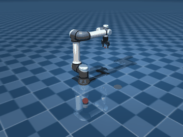

# gsoc2026-dora-agentic-robot

GSOC 2026 | Agentic DORA — agent-driven framework for intelligent robot control, autonomous decision-making, and robotic task orchestration.



*The pick-and-place under real physics, rendered from MuJoCo (`python scripts/render_demo.py`).*

## Project links

- 📄 **[Final report](FINAL_REPORT.md)** — what was built, design decisions, results, and future work.
- 📋 **[Project board](https://github.com/orgs/dora-rs/projects/8)** — gsoc2026-dora-agentic-robot.
- 🔀 **Key PRs** (all merged): [Agent core #27](https://github.com/dora-rs/gsoc2026-dora-agentic-robot/pull/27) · [LLM providers #29](https://github.com/dora-rs/gsoc2026-dora-agentic-robot/pull/29) · [Agent bridge + skills #31](https://github.com/dora-rs/gsoc2026-dora-agentic-robot/pull/31) · [Motion tools #33](https://github.com/dora-rs/gsoc2026-dora-agentic-robot/pull/33) · [Live LLM #37](https://github.com/dora-rs/gsoc2026-dora-agentic-robot/pull/37) · [Real planner #39](https://github.com/dora-rs/gsoc2026-dora-agentic-robot/pull/39) · [Collision checking #41](https://github.com/dora-rs/gsoc2026-dora-agentic-robot/pull/41) · [Runtime scene #43](https://github.com/dora-rs/gsoc2026-dora-agentic-robot/pull/43) · [Documentation #45](https://github.com/dora-rs/gsoc2026-dora-agentic-robot/pull/45)

## Documentation

Start here: **[FINAL_REPORT.md](FINAL_REPORT.md)** and
**[docs/final-submission.md](docs/final-submission.md)** (deliverables checklist +
3-command tour), then the **[docs index](docs/README.md)**. Core guides —
[Architecture](docs/architecture.md) ·
[Setup (5 min)](docs/setup.md) ·
[Tool API reference](docs/tool-reference.md) ·
[Skill authoring](docs/skill-authoring.md) ·
[Pipeline authoring](docs/pipeline-authoring.md) ·
[Extending (tools/providers/robots)](docs/extending.md).

## Status

- **Week 1 — UR5e MuJoCo simulation environment.** Reproducible MuJoCo scene (UR5e + Robotiq 2F-85, red ball, green plate target) as a dora node. → **[docs/week1-simulation.md](docs/week1-simulation.md)**
- **Week 2 — Robotiq 2F-85 gripper controller.** `gripper_command` → `gripper_ctrl` (0=open … 255=closed) with a self-running demo dataflow. → **[docs/week2-gripper.md](docs/week2-gripper.md)**
- **Week 3 — Full motion-planning dataflow.** End-to-end wiring (sim ↔ executor ↔ planner ↔ ik ↔ scene ↔ gripper) + a static connectivity validator. → **[docs/week3-dataflow.md](docs/week3-dataflow.md)**
- **Week 4 — Agent core + ToolRegistry.** The `Agent` tool-calling loop + `AgentConfig`, and a `ToolRegistry` with LRU lifecycle and base-tool pinning — the brain that replaces `command_source`. Self-running demo, no LLM needed. → **[docs/week4-agent-core.md](docs/week4-agent-core.md)**
- **Week 5 — LLM providers + failover.** A real `OpenAIProvider` (GPT-4o, token metrics) and a 3-layer failover stack (`RetryProvider` → `ProviderChain` → `AdaptiveRouter`), each an `LlmProvider` that drops straight into the `Agent` loop. Self-running failover demo, no API key needed. → **[docs/week5-llm-providers.md](docs/week5-llm-providers.md)**
- **Week 6 — Agent bridge + skills.** The dora bridge node that replaces `command_source`: the `Agent` drives the motion pipeline through `dora_read`/`dora_send`/`dora_call` tools, with behaviour authored as `SKILL.md` files injected into the system prompt. Self-running in-process demo, no dora/MuJoCo/LLM needed. → **[docs/week6-agent-bridge.md](docs/week6-agent-bridge.md)**
- **Week 7 — Motion tools + on-demand skills + a real dataflow test.** Robot-level tools (`dora_move`, `dora_gripper`, `dora_perceive`, `dora_list`) instead of raw transport, dormant skills the agent activates mid-mission, a full pick-and-place, and an integration test that runs an actual `dora` dataflow — which caught two bugs no in-process test could reach. → **[docs/week7-motion-tools.md](docs/week7-motion-tools.md)**
- **Week 8 — Replanning recovery + the agent on the real MuJoCo sim.** `dora_move` now replans a failed plan transparently (randomised planners fail on unlucky samples), with a real dataflow that injects planner failures to prove recovery across processes. And the full pick-and-place now runs on the **real MuJoCo simulator** headless — real actuators, real settling, real gripper contact — via a `sim_executor` node, no dora-moveit2 needed. → **[docs/week8-recovery-and-real-sim.md](docs/week8-recovery-and-real-sim.md)**
- **Week 9 — A live LLM drives the task.** The scripted provider is out of the loop: real GPT-4o discovers and activates the `pick-and-place` skill, perceives, and issues each motion itself, completing the mission (verified by outcome — ball on plate). Getting there meant advertising dormant skills in the prompt, self-healing sensor reads, and task-level recovery — the failure modes only a real model exposes — plus a `ReactiveMockProvider` to test recovery deterministically. → **[docs/week9-live-llm.md](docs/week9-live-llm.md)**
- **Week 10 — The real planner in the loop.** The last mock in the motion stack is gone: `dora_move` now runs the genuine dora-moveit2 RRT-Connect planner (pure-NumPy path search — no OMPL/TracIK/toppra C++ needed), producing a real multi-waypoint path that a new trajectory-executor node follows through the real sim. A live GPT-4o completes the whole pick-and-place through real planning (verified by outcome, and by every motion being a real plan), with a UR5e `RobotConfig` for the planner and a repo-local planner node that keeps the dataflow self-contained. → **[docs/week10-real-planner.md](docs/week10-real-planner.md)**
- **Week 11 — Collision checking, and the pipeline runs live.** The planner is now collision-aware: analytic UR5e forward kinematics (validated against MuJoCo to 7e-16 m) place the arm in the world so a configuration can be tested against the table and obstacles — paths route around a box that blocks the straight line, and a blocked grasp fails to plan and triggers task-level recovery. With the shared machine's coordinator port finally free, the whole pipeline ran **live over dora** for the first time — including a live GPT-4o completing the pick-and-place through the collision-checked planner on the real MuJoCo sim. → **[docs/week11-collision-checking.md](docs/week11-collision-checking.md)**
- **Week 12 — A runtime scene the agent can shape.** Obstacles are no longer a fixed table baked into the planner: the planner consumes a `scene_command` at runtime (add / remove / clear), and a new `dora_obstacle` tool lets the agent register an obstacle it's told about — the planner then routes every subsequent motion around it. Plus self-collision with adjacency masking (no false positives). Captured live over dora: a GPT-4o told to avoid a box registers it and the plans past it detour (23/34 waypoints vs the direct 12). → **[docs/week12-dynamic-scene.md](docs/week12-dynamic-scene.md)**
- **Week 13 — Documentation & demo polish.** A full documentation set — [architecture](docs/architecture.md) with a dataflow topology diagram, a under-5-minute [setup guide](docs/setup.md), a [tool API reference](docs/tool-reference.md) (schemas, examples, errors), and authoring guides for [skills](docs/skill-authoring.md), [pipelines](docs/pipeline-authoring.md), and [extensions](docs/extending.md) — plus a rendered pick-and-place demo GIF (`scripts/render_demo.py`). → **[docs/README.md](docs/README.md)**

```bash
pip install -e .
bash scripts/fetch_ur5e_assets.sh                       # one-time: fetch meshes
dora up
MUJOCO_HEADLESS=1 dora start dataflows/ur5e_sim.yml             # Week 1: sim only
MUJOCO_HEADLESS=1 dora start dataflows/ur5e_gripper_demo.yml    # Week 2: gripper demo
MUJOCO_HEADLESS=1 dora start dataflows/ur5e_full_pipeline.yml   # Week 3: full pipeline (needs dora-moveit2)
dora stop

python -m agent.agent_demo                                      # Week 4: agent core demo (no LLM/dora/MuJoCo)
python -m agent.failover_demo                                   # Week 5: 3-layer failover demo (no API key)
python -m agent.bridge_demo                                     # Week 6: agent-bridge demo (no dora/MuJoCo/LLM)
MUJOCO_HEADLESS=1 OCTOS_PROVIDER=mock dora start dataflows/ur5e_agent_demo.yml   # Week 6: agent drives the live pipeline (needs dora-moveit2)

python -m agent.pick_place_demo                                 # Week 7: pick-and-place, verified by outcome
dora run dataflows/ur5e_agent_loopback.yml --stop-after 25s     # Week 7: real dora dataflow, no external deps

dora run dataflows/ur5e_agent_recovery.yml --stop-after 25s     # Week 8: recovery — injected planner failures, agent replans
dora run dataflows/ur5e_mujoco_agent.yml --stop-after 30s       # Week 8: agent drives the REAL MuJoCo sim (needs meshes fetched)

OPENAI_API_KEY=sk-... python -m agent.live_pick_place_demo      # Week 9: a REAL LLM completes the task, verified by outcome
OPENAI_API_KEY=sk-... dora run dataflows/ur5e_mujoco_agent_llm.yml --stop-after 120s  # Week 9: live LLM through the real sim

python -m agent.live_planner_demo --mock                        # Week 10: pick-and-place through the REAL planner (no key)
OPENAI_API_KEY=sk-... python -m agent.live_planner_demo         # Week 10: a live LLM through the real RRT-Connect planner
OPENAI_API_KEY=sk-... dora run dataflows/ur5e_mujoco_planner_llm.yml --stop-after 150s  # Week 10: live LLM + real planner + real sim

MUJOCO_HEADLESS=1 dora run dataflows/ur5e_mujoco_planner.yml --stop-after 70s  # Week 11: COLLISION-checked planner on real sim (no key)
OPENAI_API_KEY=sk-... MUJOCO_HEADLESS=1 dora run dataflows/ur5e_mujoco_planner_llm.yml --stop-after 150s  # Week 11: live GPT-4o + collision-checked planner + real sim

OPENAI_API_KEY=sk-... python -m agent.live_planner_demo --obstacle  # Week 12: a live LLM told to avoid a box registers it and routes around
```

Validate dataflow wiring without a simulator:

```bash
PYTHONPATH=. python -m simulation.dataflow_check dataflows/ur5e_full_pipeline.yml
```

Tests (no MuJoCo/dora/display required):

```bash
pip install -e ".[dev]"
PYTHONPATH=. pytest tests/ -q -m "not integration"  # 199 unit tests (~5s)
PYTHONPATH=. pytest tests/ -q                       # + real dora dataflow runs (~85s)
RUN_LIVE_LLM=1 OPENAI_API_KEY=sk-... pytest tests/test_live_llm.py -q  # opt-in: a real GPT-4o run
```

## Layout

```
agent/           Agent loop, ToolRegistry, LLM providers + failover, dora bridge, robot tools (with replanning), skills
simulation/      UR5e MuJoCo node, gripper + mission sources, pipeline stub, sim executor, RRT-Connect planner (runtime scene) + trajectory executor, UR5e planner config, forward kinematics + collision/self-collision, named poses, scene model
skills/          SKILL.md domain knowledge injected into the agent's system prompt
dataflows/       dora dataflow configs (10)
scripts/         asset fetch helper + demo GIF render (render_demo.py)
tests/           ~200 unit tests + real-dataflow integration tests
docs/            guides (architecture, setup, tool/skill/pipeline/extension) + per-week build log
```
