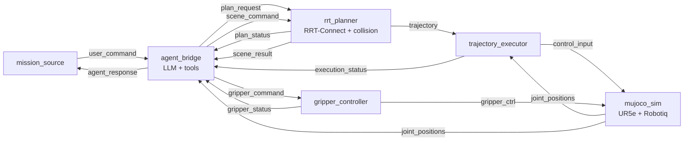
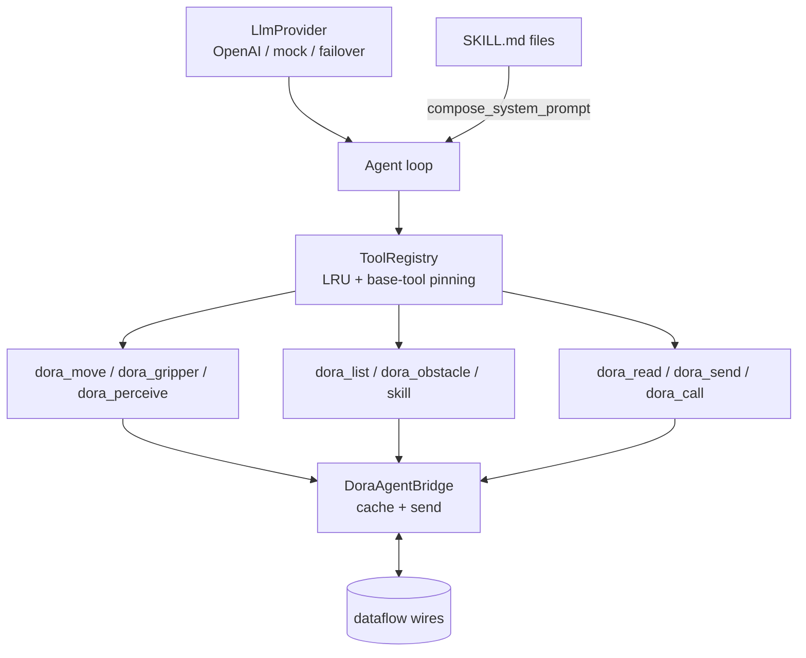

# Architecture overview

Agentic Dora bridges an LLM agent to the [dora-rs](https://dora-rs.ai) dataflow
runtime so a natural-language instruction — *"pick up the red ball and place it on
the green plate"* — drives a real robot through real motion planning in
simulation. The design goal is that **every part is swappable**: the LLM, the
motion stack, the robot, and the agent's tools and skills.

## The one idea

A dora dataflow is a graph of nodes exchanging typed messages. The motion
pipeline (simulator → planner → executor → gripper) is ordinary dora. The novelty
is a single node — the **agent bridge** — that replaces the hand-written
`command_source` a normal pipeline would use. Instead of a fixed script, an LLM
decides what to do and drives the pipeline through **tools** that read and write
the dataflow's wires.

```
command_source  (a fixed script)          →  agent_bridge  (an LLM + tools)
emits plan_request, gripper_command, …       emits the same wires, but by decision
```

Everything downstream is unchanged. The agent is just a smarter source.

## Pipeline topology

The canonical pipeline is the collision-checked planner on the real MuJoCo
simulator (`dataflows/ur5e_mujoco_planner.yml`):



- **mission_source** — emits one natural-language mission, logs the reply. Swap it
  for an interactive source to type missions live.
- **agent_bridge** — the LLM agent. Reads sensor/status wires into a cache,
  decides, and drives the pipeline through its tools. The brain of the system.
- **rrt_planner** — the real dora-moveit2 RRT-Connect planner (pure-NumPy path
  search) with collision checking against the table and any obstacles. Turns a
  `plan_request` (start + goal) into a multi-waypoint `trajectory`.
- **trajectory_executor** — follows the planned path on the real simulator,
  waypoint by waypoint, reporting `execution_status` only when the whole path is
  done — so "one `dora_move` = one finished motion" holds against real physics.
- **gripper_controller** — the Robotiq 2F-85 driver: `gripper_command` →
  `gripper_ctrl` (0 = open … 255 = closed).
- **mujoco_sim** — the UR5e + Robotiq scene as a dora node (real actuators, real
  contact, `nq = 21`).

## Inside the agent bridge



- **Agent** runs the tool-calling loop: prompt the provider, execute the tool
  calls it returns, feed results back, repeat until the provider says stop.
- **LlmProvider** is the model behind the loop — `OpenAIProvider` (GPT-4o), the
  deterministic `MockProvider`/`ReactiveMockProvider` for tests, or a failover
  stack (`RetryProvider` → `ProviderChain` → `AdaptiveRouter`). See
  [llm-providers](week5-llm-providers.md).
- **ToolRegistry** holds the tools, keeps the most-used active under an LRU cap,
  and pins the base tools so they're never evicted.
- **DoraAgentBridge** is the adapter the tools talk through: it caches incoming
  dataflow inputs and sends outputs, converting the wire format (JSON / float
  arrays) both ways.
- **Skills** (`SKILL.md`) are procedural knowledge injected into the system
  prompt; dormant ones are advertised by name and pulled in on demand via the
  `skill` tool. See [skill-authoring](skill-authoring.md).

## Pipeline variants

The agent side is identical across these; only the motion stack below it changes
(that's the point). See [pipeline-authoring](pipeline-authoring.md) for the full
list and [setup](setup.md) to run them.

| Dataflow | Motion stack | Provider |
|----------|--------------|----------|
| `ur5e_agent_loopback.yml` | in-process stub (teleport) | mock |
| `ur5e_agent_recovery.yml` | stub with injected planner failures | mock |
| `ur5e_mujoco_agent.yml` | real sim via direct-control `sim_executor` | mock |
| `ur5e_mujoco_planner.yml` | real sim via RRT-Connect + collision | mock |
| `ur5e_mujoco_planner_llm.yml` | real sim via RRT-Connect + collision | GPT-4o |

## Message formats

Two wire encodings cross the dataflow:

- **JSON** (commands and status) — a UTF-8 JSON payload in a byte array, e.g.
  `plan_request` = `{"start": [6 floats], "goal": [6 floats] | "named_pose"}`,
  `plan_status` = `{"success": bool, "message": str, "num_waypoints": int}`.
- **Float arrays** (state and control) — `joint_positions` is the full `qpos`,
  `control_input` / `trajectory` are joint targets.

The `DoraAgentBridge` hides both behind `send_json` / `read_cached`, so tools deal
in dicts, not bytes.

## Where to go next

- Run it: [setup.md](setup.md)
- The tools the agent calls: [tool-reference.md](tool-reference.md)
- Author robot knowledge: [skill-authoring.md](skill-authoring.md)
- Author / wire pipelines: [pipeline-authoring.md](pipeline-authoring.md)
- Add tools, providers, robots: [extending.md](extending.md)
- Week-by-week build log: the `weekN-*.md` notes in this folder.
